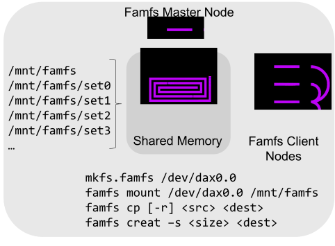
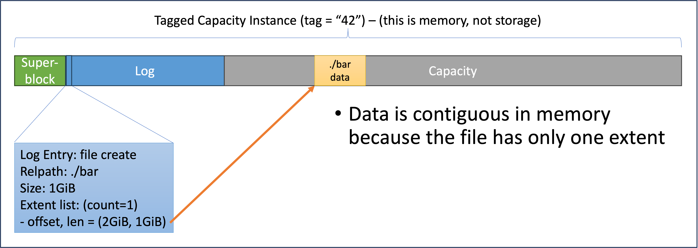
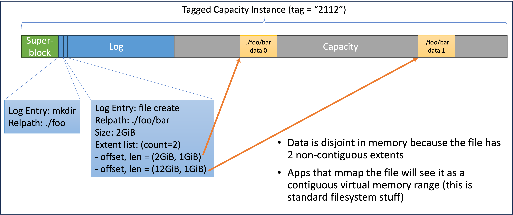

<p align="center">
  
</p>

# Famfs Shared Memory Filesystem Framework - User Space Repo

This is the famfs user space repo. Also required is a famfs-enabled Linux kernel. A viable
kernel can be accessed one of the following ways:

* [Famfs v2 patch set at lore.kernel.org](https://lore.kernel.org/linux-fsdevel/ZjFcG9Q1CegMPj_7@casper.infradead.org/T/#t) - Famfs v2 was published April 29, 2024.
* [Famfs v1 patch set at lore.kernel.org](https://lore.kernel.org/linux-fsdevel/cover.1708709155.git.john@groves.net/T/#t) - Famfs was published to the Linux community in February 2024.
* [famfs-linux git repo](https://github.com/cxl-micron-reskit/famfs-linux) - The famfs v2 patches are also available as the default branch in this git repo.
* [Patch set incorporating famfs into the Linux FUSE](https://lore.kernel.org/linux-fsdevel/20250421013346.32530-1-john@groves.net/T/#t)

# Famfs Talks
* [Famfs was introduced at the 2023 Linux Plumbers Conference](https://lpc.events/event/17/contributions/1455/) ([abstract](https://lpc.events/event/17/contributions/1455/), [slides](https://lpc.events/event/17/contributions/1455/attachments/1179/2546/cxl-shared-fam-what-is-needed-v4.pdf), [youtube](https://www.youtube.com/watch?v=aA_DgO95gLo))
* [Famfs session at LSFMM 2024](https://www.youtube.com/watch?v=nMaZhXJJgmU&list=PLbzoR-pLrL6oj1rVTXLnV7cOuetvjKn9q&index=67)
* [Famfs and shared memory status session at the 2024 Linux Plumbers Conference](https://lpc.events/event/18/contributions/1827/) ([slides](https://lpc.events/event/18/contributions/1827/attachments/1583/3349/famfs-lpc-2024-v3.pdf), [Youtube](http://www.youtube.com/watch?v=4MsTupxge70))
* [2025 Famfs talk for the Open Compute Project (OCP) Composable Memory Subsystems (CMS) working group](https://www.youtube.com/watch?v=L1QNpb-8VgM&t=1680)

# What is Famfs?

Famfs is a scale-out shared-memory file system. If two or more hosts have shared access
to memory, a famfs file system can be created in that memory, such that data sets can be
saved to files in the shared memory.

<table border="0%">
  <tr>
    <!-- Text Cell -->
    <td>
<p>For apps that can memory map files, memory-mapping a famfs file provides direct access to
the memory without any page cache involvement (and no faults involving data movement at all).</p>

<p>Consuming data from famfs files works the same as any other file system, meaning almost any
app that can use data in files can use data in shared memory</p>

<p>Files default to read-only on client nodes, but famfs fully supports converting any file to
writable on any client - in which case the app/user is responsible for managing cache coherency.
Famfs maintains cache coherency for its structures and metadata, but does not attempt to do so for other apps.</p>

  
</p>
    </td>
    <!-- Image Cell -->
    <td align="right" width="40%">
      
    </td>
  </tr>
</table>

Famfs effectively does the following:
* Enables disaggregated shared memory for any app that can use shared files
* De-duplicates memory, because multiple nodes can share a single copy of data in memory
* Reduces or avoids shuffling
* Enables larger in-memory data sets than previously possible, because FAM could be larger 
  than the memory limit of any one server


## Documentation Contents

* Overview - What is it and how does it work at a high level (this document)
* [Getting Started with famfs](markdown/getting-started.md) (build, test, install)
* [Famfs cli reference](markdown/famfs-cli-reference.md)

# Background

In the coming years the emerging CXL standard will enable shared, disaggregated memory
in multiple forms - included multi-port memory and fabric-attached
memory (FAM). Famfs is intended to provide a viable usage pattern for FAM that many apps
can use without modification. Shared memory implementations already exist in early 2024.

Famfs is an fs-dax file system that allows multiple hosts to mount the same file system
from the same shared memory. The file system is administered by a Master, but can
be concurrently mounted by one or more Clients (which default to read-only access to files,
but writable access is permitted).

Why do we need a new fs-dax file system when others (e.g. xfs and ext4) exist? Because the existing
fs-dax file systems use write-back metadata (as pretty much all conventional file systems do).
Write-back metadata is not compatible with scale-out shared memory access, because two or more hosts
have no way to agree on the definitive state of metadata (not to mention space allocation).

## What is dax?
In Linux, special purpose memory is exposed as a dax device (e.g. ```/dev/dax0.0```).
Applications can memory map dax memory by opening a dax device calling the mmap() system call
on the file descriptor.

Dax memory can be onlined as system-ram, but that is not appropriate if the memory is
shared. The first of many reasons for this is that Linux zeroes memory that gets onlined,
which would wipe any shared contents.

In CXL V3 and beyond, dynamic capacity devices (DCDs) support shared memory. A DCD is really
just a memory device with an allocator and access control built-in. Sharable memory
has a mandatory Tag (UUID) which is assigned when the memory is allocated;
all hosts with shared access identify the memory by its Tag.
"Tagged Capacity" will be exposed under Linux as tagged dax devices
(e.g. ```/sys/devices/dax/<tag>``` - the specific recipe is TBD)

## What is fs-dax?

Fs-dax is a means of creating a file system that resides in dax memory. A file in an fs-dax
file system is just a convenient means of accessing the subset of dax memory that is allocated
to that file. If an application opens an
fs-dax file and calls mmap() on the file descriptor, the resulting pointer provides direct
load/store access to the memory - without
ever moving data in and out of the page cache (as is the case with mmap() on "normal" files).

Posix read/write are also supported, but those are not the optimal use case for fs-dax;
read and write effectively amount to memcpy() in and out of the file's memory.


# How can famfs do interesting work?

It is common in data science and AI workloads to share large datasets (e.g. data frames)
among many compute jobs that share the data. Many components in these tool chains can
memory map datasets from files. The "zero-copy formats" (e.g. Apache Arrow) are of 
particular interest because they are already oriented to formatting data sets in a way
that can be efficiently memory-mapped.

Famfs enables a number of advantages when the compute jobs scale out:

* Large datasets can exist as one shared copy in a famfs file, effectively de-duplicating memory
* Shuffling and sharding can be avoided if enough FAM is available, potentially removing the quadratic 
  order of data distribution
* When an app memory-maps a famfs file, it is directly accessing the memory;
  unlike block-based file systems, data is not read (or faulted) into local memory
  in order to be accessed

Jobs like these can be adapted to using famfs without even recompiling any components,
through a procedure like this.

1. Wrangle data into a zero-copy format
2. Copy the zero-copy files into a shared famfs file system
3. Component jobs from any node in the cluster can access the data via mmap() from files in the
   shared famfs file system
4. When a job is over, dismount the famfs file system and make the memory available for
   the next job...

# Famfs Requirements

1. Must support a file system abstraction backed by sharable dax memory
2. Files must efficiently handle VMA faults
3. Must support metadata distribution in a sharable way
4. Must handle clients with a stale copy of metadata

A few observations about the requirements

| **Requirement** | **Notes** |
|-----------------|-----------|
| 1               | Making shared memory accessible as files means that most apps that can consume data from files (especially the ones that use ```mmap()```) can experiment with disaggregated shared memory.         |
| 2 | Efficient VMA fault handling is absolutely mandatory for famfs to perform at "memory speeds". Famfs caches file extent lists in the kernel, and forces all allocations to be huge page aligned for efficient memory mapping and fault handling. |
| 3 | There are existing fs-dax file systems (e.g. xfs, ext4), but they use cached, write-back metadata. This cannot be reconciled with more than one host concurrently (read-write) mounting those file systems from the same shared memory. Famfs does not use write-back metadata; that, along with some annoying limitations, solves the shared metadata problems. |
| 4| The same annoying restrictions mean that in its current form, famfs does not need to track whether clients have consumed all of the metadata. |

# Theory of Operation

Famfs is a Linux file system that is administered from user space by the code in this repo.
The host device is a dax memory device (e.g. ```/dev/dax0.0```).

The file infrastructure lives in the Linux kernel, which is necessary for Requirement #2
(must efficiently handle VMA faults). But the majority of the code lives in user space
and executes via the famfs cli and library.

The "Master" node is the system that created a famfs file system (by running ```mkfs.famfs```).
The system UUID of the master node is stored in the superblock, and the famfs cli and library
prevent client nodes from mutating famfs metadata for a file system that they did not create.

As files and directories are allocated and created, the Master adds those files to the
famfs append-only metadata log. Clients gain visibility of files by periodically re-playing the
log.

## Famfs On-media Format

The ```mkfs.famfs``` command formats an empty famfs file system on a dax memory device.
An empty famfs file system consists of a superblock at offset 0 and a metadata log
at offset 2MiB. The format looks like this:


Note this is not to scale. Currently the superblock is 2MiB and the log defaults to 8MiB, and
the minimum supported memory device size is 4GiB.

After a file has been created, the media format looks like this:



The following figure shows a slightly more complex famfs format:



During ```mkfs.famfs``` and ```famfs mount```, the superblock and log are accessed via raw
mmap of the dax device. Once the file system is mounted, the famfs user space only accesses
the superblock and log via meta files:

```
# mount | grep famfs
/dev/dax1.0 on /mnt/famfs type famfs (rw,nosuid,nodev,noexec,noatime)
# ls -al /mnt/famfs/.meta
total 4096
drwx------ 2 root root       0 Feb 20 10:34 .
drwxr-xr-x 3 root root       0 Feb 20 10:34 ..
-rw-r--r-- 1 root root 8388608 Feb 20 10:34 .log
-r--r--r-- 1 root root 2097152 Feb 20 10:34 .superblock
```

The famfs meta files are special-case files that are not in the log. The superblock is a
known location and size (offset 0, 2MiB - i.e. a single PMD page). The superblock contains
the offset and size of the log. All additional files and directories are created via log entries.

The famfs kernel module never accesses the memory of the dax device - not even the superblock
and log. This has RAS benefits. If a memory error occurs (non-correctable errors, poison, connectivity
problems, etc.) the process that accessed the memory should receive a SIGBUS, but kernel code
should not be affected.

Famfs currently does not include any stateful or continuously running processes.
When the library creates files,
allocation and log append are serialized via a ```flock()``` call on the metadata log file. 
This is sufficient since only the Master node can perform operations that write the log.

## Famfs Operations

Famfs files can be accessed through normal means (read/write/mmap), but creating famfs files requires
the famfs user space library and/or cli. File creation consists of the following (slightly
oversimplified) steps:

1. Allocate memory for the file
1. Write a famfs metadata log entry that commits the existence of the file
1. Instantiate the file in the mounted famfs instance

Directory creation is slightly simpler, consisting of:

1. Commit the directory creation in the log
1. Instantiate the directory in the mounted famfs instance

| **Operation** | **Notes** |
|---------------|-------------|
| ```mkfs.famfs```    | The host that creates a famfs file system becomes the Master. Only the master can create files in a famfs file system, though Clients can read files (and optionally be given write permission)            |
| ```famfs mount``` | Master and Clients: Mount a famfs file system from a dax or pmem device. Files default to read-only on Clients |
| ```famfs logplay``` | Master and Clients: Any files and directories created in the log will be instantiated in the mounted instance of famfs. Can be re-run to detect and create files and directories logged since the last logplay. |
| ```famfs fsck``` | Master and Clients: The allocation map will be checked and errors will be reported|
| ```famfs check``` | Master and Clients: Any invalid famfs files will be detected. This can happen if famfs files are modified (e.g. created or truncated) by non-famfs tools. Famfs prevents I/O to such files. The file system can be restored to a valid state by unmounting and remounting |
| ```famfs mkdir [-p]``` | Master only: Create a directory (optionally including missing parent directories). This creates a directory in the mounted file system. |
| ```famfs creat``` | Master only: Create and allocate a famfs file. |
| ```famfs cp [-r]``` | Master only: Copy one or more files into a famfs file system|
| ```famfs flush``` | Master and Clients: Flush or invalidate the processor cache for a file; this may be needed when mutating files|
| ```read()/write()``` | Master and Clients: any file can be read or written provided the caller has appropriate permissions |
| ```mmap()``` | Master and Clients: any file can be mmapped read/write or read-only provided the caller has sufficient permissions |

For more detail, see the [famfs cli reference](markdown/famfs-cli-reference.md).

## Missing File System Operations
Famfs is currently lacks the ability to do some standard file system operations; ```rm``` and ```truncate```
```append``` are not supported. By omitting these operations, we avoid the complex distributed computing problems of 1) figuring
out when it is safe to re-use freed space, and 2) allocating space dynamically.

| **Operation** | **Notes** |
|--|--|
| ```rm``` | The remove (```rm```) operation is currently not supported, which allows famfs to avoid the problem of freeing space and determining when it is safe to re-use the space for a different file. Many use cases can work round this by freeing whole famfs file systems rather than individual files - just free the memory (if it's a DCD, CXL supports freeing allocations, including forced remove; Then a new famfs file system can be created in a new sharable DCD allocation). |
| ```append``` | Appending a file requires additional allocation sooner or later. Since famfs files are strictly pre-allocated, ```append``` is not allowed. |
| ```truncate``` | The ```truncate``` operation can make a file either smaller or larger. When making the file smaller, it has the same issues as ```rm```. When making a file larger, ```truncate``` has the same issues as ```append```. Thus famfs does not support truncate. |

## Rogue File System Operations

Famfs requires that any operation that creates files files be done via the famfs api or cli - in order to properly
allocate space and log the metadata. Operations that affect allocation are not allowed after a file has been created, 
which is why famfs has no  commands/APIs for ```rm```, ```append``` or ```truncate```. However, famfs currently has
no way to prevent a user with sufficient premissions from attempting these operations via the standard file system
tools.

If a famfs file is removed or its size is changed by standard utilities, it will be treated as invalid
by famfs, and famfs will prevent writing or reading until the file is repaired.

Most of the operations resulting in invalid files are recoverable.

| **Invalid Operation** | **Notes** | **Recovery**                     |
|-----------------------|-----------|----------------------------------|
| Linux ```rm``` | If the caller has sufficient permission, the file will disappear from the mounted famfs file system. | The file will reappear if you replay the log, as in ```famfs logplay /mnt/famfs```. |
| Linux ```ftruncate```              | If a file's size is changed from the allocated size, it is treated as invalid until it is repaired. Logged truncate seems like a less likely requirement than logged delete, but let's talk if you need it. | umount/remount, possibly logplay |
| Linux ```cp```                    | Using standard 'cp' where the destination is famfs is invalid. The 'cp' will fail, but it may leave behind an empty and invalid file at the destination.  | umount/remount  |

## Are These Limitations Permanent?

No! Well, some maybe, but most of the famfs limitations can be mitigated or eliminated if
we decide to write enough code. Those Byzantine generals need to be managed, etc.

The current famfs limitations are chosen to keep the problem manageable and the code
reasonably sized in the early stages.

# What is Famfs NOT?

Famfs is not a general purpose file system, and unlike most file systems, it is not a data
storage tool. Famfs is a data *sharing* tool.

