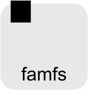
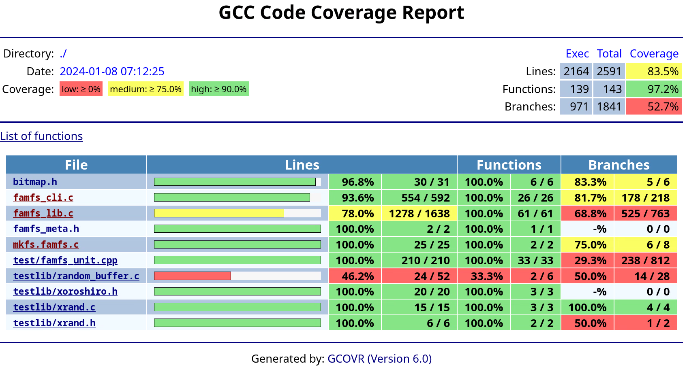

<p align="center">
  
</p>

# Getting started with famfs

At this early stage we are not yet distributing famfs in package-manager bundles (e.g. rpm, deb).
The famfs kernel module has been [submitted to the Linux community as an RFC](https://lore.kernel.org/linux-fsdevel/20250421013346.32530-1-john@groves.net/T/#m16f1386e90a6b40ceb60ae7feca7bbff281956bc),
[and is available from this git repo](https://github.com/cxl-micron-reskit/famfs-linux).
See the [famfs kernel documentation](building-a-kernel.md) for more info on building an appropriate kernel. 
The steps to test famfs are as follows:

## Contents

1. [Install prerequisites](#Known-Prerequisites)
1. Build and install a [famfs-enabled kernel](building-a-kernel.md) with the famfs patches
2. [Build the famfs user space](#Building-famfs) (this repo)
3. [Configure one or more real or simulated dax or pmem devices](vm-configuration.md)
3. [Run the famfs tests](#Running-tests)
4. Create and use a famfs file system
5. Profit!!

## Other Quick Links
- [Configuring Virtual Machines for famfs](vm-configuration.md)
- [Famfs CLI Reference](famfs-cli-reference.md)
- [Famfs Quirks, Bugs and "Features"](quirks-bugs-features.md)

# Preparing to build famfs

## Known Prerequisites

### Fedora 42 Prerequisites
On fedora, you probably need to install the following, at minimum
```
sudo dnf5 group install -y c-development
```
On older fedora that might be:
```
sudo dnf groupinstall -y "Development Tools"
```
And here are the rest (that we can remember just now - send corrections
please)
```
sudo dnf install -y \
    kernel-devel \
    cmake \
    g++ \
    libuuid-devel \
    daxctl \
    ndctl \
    gcovr \
    valgrind \
    systemd-devel \
    meson \
    libyaml-devel \
    daxctl-devel \
    libcurl-devel \
    libasan-static \
    libubsan-static  # for sanitize builds
```

#### Additional prerequisites for building ndctl from source

If building the local ndctl (which has famfs dax mode support not yet upstream),
these additional packages are required:
```
sudo dnf install -y \
    kmod-devel \
    json-c-devel \
    libtraceevent-devel \
    libtracefs-devel \
    asciidoctor \
    keyutils-libs-devel \
    iniparser-devel
```

Pay attention to error messages when you build, new dependencies may arise later, and
different kernel installations may have different missing dependencies.

### Ubuntu 23 Prerequisites

```
sudo apt install -y \
    build-essential \
    cmake \
    uuid-dev \
    zlib1g-dev \
    daxctl \
    ndctl \
    gcovr \
    valgrind \
    libsystemd-dev \
    meson \
    libyaml-dev \
    libdaxctl-dev \
    libndctl-dev \
    libcurl4-openssl-dev
```

#### Additional prerequisites for building ndctl from source

If building the local ndctl (which has famfs dax mode support not yet upstream),
these additional packages are required:
```
sudo apt install -y \
    libkmod-dev \
    libjson-c-dev \
    libtraceevent-dev \
    libtracefs-dev \
    asciidoctor \
    libudev-dev \
    libkeyutils-dev \
    libiniparser-dev \
    pkg-config
```

Pay attention to error messages when you build, new dependencies may arise later, and
different kernel installations may have different missing dependencies.

# Building famfs

From the top level directory:

    make clean all

The first time through keep in mind that you might need to resolve dependencies to get it
to run.

# Installing famfs

You must load the kernel module in order to use famfs

    sudo modprobe famfs

Famfs does not have packaged installation files yet, once you have built it, you can
install the user space library and cli with the following command:

    sudo make install

# Preparing to run famfs

In order to run famfs you need or a
devdax device (e.g. /dev/dax0.0). To run in a shared mode, you need more than one
system that shares a memory device.

‼️Note: in April 2024 support for ```/dev/pmem``` devices was deprecated, and the default device was changed to ```/dev/dax0.0```. If you are using real or simulated (e.g. virtio) pmem devices, they can be converted to devdax mode via ```ndctl```.

Gory details for setting up virtual machines and virtual dax and pmem devices are in the
[Configuring Virtual Machines for famfs](vm-configuration.md) documentation.


# Running tests
Famfs already has a substantial set of tests, though we plan to expand them substantially
(and we would love your help with that!).

## Running smoke tests

The famfs smoke tests load the kernel module, create and mount a famfs file system, and
test its functionality.
The smoke tests currently must be run by a non-privileged user with passwordless sudo
enabled. Running the tests as root does not work, because they expect certain operations to
fail due to non-root privileges.

You can enable passwordless sudo for user 'fred' in your test systems and VMs as follows:

    # Substitute your username for "fred", and run this command as root
    echo "fred ALL=(ALL) NOPASSWD: ALL" > /etc/sudoers.d/fred

:bangbang: **Important:** If you do not enable passwordless sudo for your account, smoke tests will not run correctly. If you run the entire smoke test suite under sudo (e.g. ```sudo make smoke```), it it will not work correctly because the smoke tests expect to be running as a non-privileged user except when the smoke tests invoke sudo.

If you have already successfully built famfs and configured a pmem device, you can run smoke tests
as follows:

    make smoke

You can also optionally specify the device and mount point as environment variables when running smoke tests

    DEV=/dev/dax1.0 MPT=/mnt/famfs make smoke

or, if you're running tcsh or csh shells:

    env DEV=/dev/dax1.0 MPT=/mnt/famfs make smoke

You can see an example of the [full output from run_smoke.sh here](smoke-example.md)

The smoke tests (by default) require the following:

* A valid /dev/dax0.0 device which is at least 4GiB in size

## Running unit tests

Famfs uses the googletest framework for unit testing code components, although test coverage
is still limited.

    make test

You can also do this:

    sudo debug/test/famfs_unit_tests

Important note: the unit tests must be run as root or under sudo, primarily because
getting the system UUID only works as root. We may look into circumventing this...

## Valgrind Checking
You can run the smoke tests under valgrind as follows:

    DEV=/dev/dax1.0 make smoke_valgrind

If the smoke tests complete and valgrind finds no errors, you will see a message such as this:

    Congratulations: no errors found by Valgrind

Otherwise, you will see the valgrind output from just the tests where valgrind found problems.

## Code Coverage

To build for coverage tests, do the following in user:

    make clean coverage
    DEV=/dev/dax1.0 make coverage_test
    firefox coverage/famfs_unit_coverage/index.html   # or any other browser

The resulting report looks like this as of early 2024.


This is the combined coverage from smoke and unit tests.
